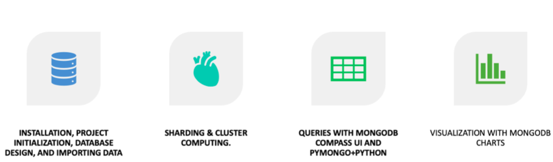
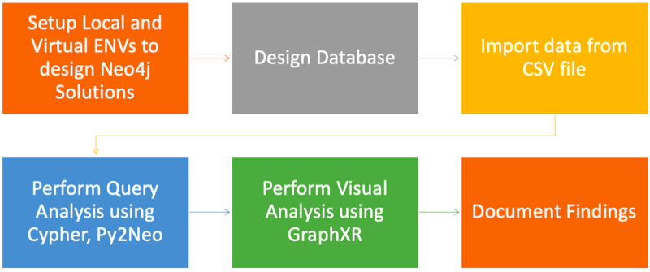
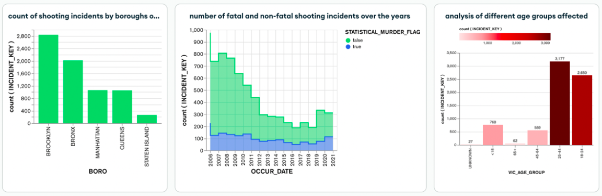
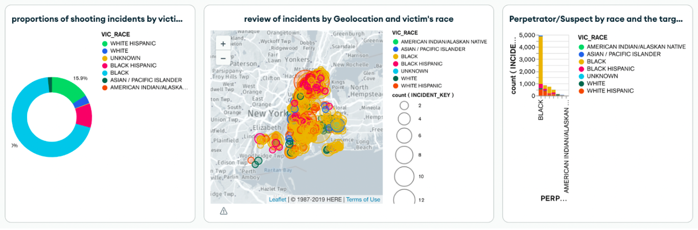
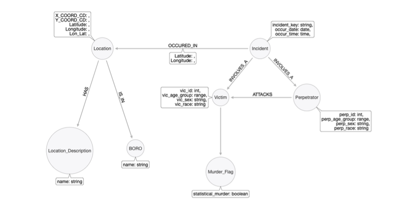

  

## Analyzing and Mitigating Gun Violence: A NoSQL Database-Driven Approach Using MongoDB and Neo4j
[Blog](https://medium.com/@sachinsm2022/accelerating-data-analytics-with-nosql-database-solutions-mongodb-and-neo4j-aa7f358d540): Analyzing and Mitigating Gun Violence: A NoSQL Database-Driven Approach Using MongoDB and Neo4j on NYPD Shooting Incident Data

### Abstract
The widespread issue of gun violence, notably in schools, is a significant concern across the United States. This project specifically concentrates on the analysis of gun violence data sourced from the City of New York via OPEN API Access. It employs NoSQL Databases like MongoDB and Neo4j to develop efficient solutions to derive insights. The ultimate goal is to enhance policing efforts and effectively diminish the occurrence of shooting incidents.

### Motivation
The emotional and societal impacts of gun violence, generating fear and adversely affecting lifestyles, motivated the project to utilize historical data to assist the NYPD in preventing and reducing such incidents on a broader scale.

### Dataset
> https://catalog.data.gov/dataset/nypd-shooting-incident-data-historic

A comprehensive list of shooting incidents in NYC from 2006, updated quarterly and reviewed by the Office of Management Analysis and Planning before publication on the NYPD website. Each entry details the event, location, time, and demographics of the suspect and victim, providing valuable information for public understanding of criminal activity.

> ### MongoDB Workflow

> ### Neo4j Workflow

### MongoDB Solution
> **Visualizations on MongoDBCharts**

- The initial chart displays the count of shooting incidents per New York borough in descending order, highlighting Brooklyn with the highest number (approx. 2800) and Staten Island with the fewest incidents.
- The second chart analyzes the trend of shooting incidents from 2006 to 2021, distinguishing between incidents resulting in murders and injuries. Notably, shooting incidents spike during economic downturns, such as the 2008 Big Recession and the 2020 COVID-19 Pandemic.
- The third chart presents statistics on age groups affected, indicating a higher impact on the 25-44 and 18-24 age brackets.

- The left chart indicates the racial distribution of shooting victims, with a predominant proportion among the Black race at approximately 69%, followed by white Hispanics at about 15.9%.
- The middle chart illustrates the incident intensity across geolocations, categorized by race and ethnicity. Incidents are more intense among the Black race in the southern regions, while Black Hispanics are primarily affected in the northern part of NY.
- The rightmost stacked bar graph summarizes the proportion of individuals from different ethnicities targeted by perpetrators of each race. It reveals that perpetrators of the Black race tend to target more individuals within their racial group, raising questions about potential intra-ethnic hate crimes.

### Neo4J Solution

> **Datamodel**

